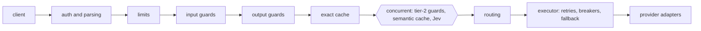

# GG

A self-hosted, OpenAI-compatible LLM gateway. Point the stock OpenAI SDK (or the Anthropic SDK) at GG and get one
API over 25+ providers, plus what a plain proxy does not give you:

- **Intelligent routing.** For `gg/auto`, Jev (TypeSafe's "system one" classifier) scores each prompt and GG sends it
  to the weak or the strong model. One knob, α, trades cost for quality.
- **Guardrails** on the way in and out: rule packs, secrets and PII detection, hosted PromptGuard for prompt
  injection, local ONNX models for toxicity, topic and grounding. Shadow mode lets a new guard log without blocking.
- **Reversible PII redaction.** PII becomes placeholders (`[EMAIL_1]`) before anything leaves GG; the reply gets the
  real values back. Jev, PromptGuard and the caches only ever see placeholders.
- **Exact and semantic caching** (Redis 8 vector search), with cached streams replayed as SSE.
- **Reliability**: retries, per-deployment circuit breakers and cross-provider fallback up to the first token.
- **Per-key limits and budgets** (Redis Lua token bucket, micro-USD budgets) and a per-provider spend cap.
- **Observability**: Prometheus + Grafana, a Langfuse trace per request, one structured log line per request, and
  `x-gg-*` response headers showing the route, provider, cache status, cost-relevant timings and trace id.

## Quickstart

```bash
uv sync --extra ml                       # python 3.13; the ml extra adds the local guard models
cp .env.example .env                     # add provider keys, GG_JEV_API_KEY, GG_PROMPTGUARD_API_KEY
docker compose up -d                     # redis 8, prometheus, grafana (add --profile langfuse for tracing)
.venv/bin/gg keys create --id me --name "Me"   # mint a virtual key, then add it to config/keys.yaml
.venv/bin/gg serve                       # http://127.0.0.1:8000
```

```python
from openai import OpenAI

gg = OpenAI(base_url="http://127.0.0.1:8000/v1", api_key="gg-live-...")
reply = gg.chat.completions.create(model="gg/auto", messages=[{"role": "user", "content": "hi"}])
```

Try it without any provider key: `GG_MODEL_PROFILE=ci GG_KEYS_FILE=tests/fixtures/keys/keys.yaml .venv/bin/gg serve`
runs on the built-in mock provider; the token is in `tests/fixtures/keys/tokens.yaml`. A small web playground is at
`/playground` outside production.

| Model name | Meaning |
|---|---|
| `gg/auto` | Jev decides weak or strong per prompt |
| `gg/weak`, `gg/strong` | fixed tier with a fallback chain across providers |
| `gg/coding-plans` | Z.ai, Alibaba and MiniMax coding-plan subscriptions, falling back to paid labs |
| `openrouter/openai/gpt-6-luna`, `gemini/gemini-3.1-flash-lite`, ... | one concrete deployment |

## Results

### Routing (`gg/auto`)

170 hand-written prompts over 13 categories ([evals/routing](evals/routing)). Weak model gpt-6-luna, strong model
gpt-6.1-sol (both via OpenRouter), answers graded by deterministic checkers or a pairwise judge (Claude Haiku 4.5,
both orders). α was chosen on the tune split and is reported on the held-out split. The whole live run cost $0.16.

| Router | APGR (all) | APGR (held-out) | AUROC (held-out) | Strong share for 50% of the gain |
|---|---|---|---|---|
| Jev `strong_helps` (shipped) | 0.78 | 0.80 | 0.82 | 12.7% |
| Jev P(frontier tiers) | 0.63 | 0.65 | 0.66 | 17.9% |
| length/keyword heuristic | 0.67 | 0.64 | 0.66 | 35.1% |
| random | 0.50 | 0.50 | — | 50% |

At the shipped α = 0.25: 30.6% of requests go strong, 82% of the quality gap between always-weak (0.888) and
always-strong (0.953) is recovered, at 33% lower cost than always-strong. Random routing at the same share recovers
31%. APGR is the area under the quality-vs-strong-share curve, normalised so random = 0.5 and perfect = 1.

### Gateway overhead and throughput

Locust against the mock upstream (TTFT 50 ms, 40 tokens), one uvicorn worker on an Apple M4 laptop
([full report](loadtest/results/20261007-193125/report.md)). Overhead is measured server-side (total minus upstream
time) and cross-checked against direct-to-mock runs at the same rate.

| Configuration | Non-stream overhead p50 / p99 @100 RPS | Stream added TTFT p50 / p99 @50 RPS | Max sustainable RPS |
|---|---|---|---|
| bare (no guards, no cache) | 9 / 32 ms | 51 / 67 ms | 299 |
| default (rule guards + exact cache) | 22 / 75 ms | 58 / 84 ms | 192 |
| default with Redis (limits, budgets, cache, spend guard) | 17 / 106 ms | 90 / 163 ms | — |

- An exact-cache hit answers in 46 ms p50, against 294 ms for a miss through the mock.
- Most of the streaming overhead is the output guard holding back the first window of text before releasing it.
  With that window set to one character, added TTFT drops from 51 to 11 ms p50.
- Starting guard and probe tasks eagerly (they finish without waiting for the event loop) cut the guard stages
  from 3.8 / 6.6 ms to 0.4 / 0.2 ms p50 under load and the default config's p99 from 113 to 75 ms
  ([before](loadtest/results/20261007-193125/report.md), [after](loadtest/results/20261008-guard-eager/report.md)).
  The Redis row and the max-RPS column were measured before this change.
- A 12,468-request burst against a 120 RPM key returned 49 successes and 12,419 `429`s, with no limit or budget
  violations.

### Tests and CI

About 2,600 tests: unit, contract (every adapter against recorded provider fixtures), chaos (fallback under
injected 529s and timeouts), integration through the real app with the stock OpenAI SDK, and real Redis 8. CI
([.github/workflows/ci.yml](.github/workflows/ci.yml)) runs ruff, strict pyright, import-linter contracts, the test
suite with a Redis service, and an eval gate that fails a PR when any guardrail or cache eval item regresses against
its committed baseline ([docs/ci.md](docs/ci.md)).

## Architecture



Every stage is a small class in an onion pipeline over a shared request context; providers sit behind one adapter
contract, and `build_app` is the only place concrete classes are wired together. Details, ordering decisions and
design patterns: [docs/architecture.md](docs/architecture.md).

## Configuration

All behaviour is versioned YAML in [config/](config), hashed into every response (`x-gg-config`) and trace:
`models.yaml` (providers, deployments, groups, aliases, profiles), `routing.yaml` (Jev, α), `policies/` (guardrails),
`cache.yaml`, `limits.yaml`, `keys.yaml`. Secrets come only from `GG_*` environment variables (see
[.env.example](.env.example)). Adding an OpenAI-compatible provider is a YAML quirk profile, not code.

## Deployment

`docker compose up` runs the gateway, Redis 8, Prometheus and Grafana; `--profile langfuse` adds a self-hosted
Langfuse; `--profile hosted` adds Caddy with automatic TLS. The target host is an Oracle Cloud Always Free ARM VM,
deployed from `main` by a GitHub Actions workflow with automatic rollback ([docs/deploy.md](docs/deploy.md)).

| URL | What |
|---|---|
| http://localhost:8000 | gateway (`/v1/chat/completions`, `/v1/messages`, `/v1/models`, `/metrics`, `/readyz`) |
| http://localhost:3000 | Grafana (overview and providers dashboards) |
| http://localhost:9090 | Prometheus |
| http://localhost:3001 | Langfuse (with `--profile langfuse`) |

## Team

Siddham Jain (routing, foundation, reliability), Ishan Avasthi (provider adapters), Ashwin Saklecha (guardrails),
Abhinav (API, auth, limits and budgets), Aditya Jaiswal (caching, observability, load testing), Charan Bhatia (infra,
CI, deployment).
