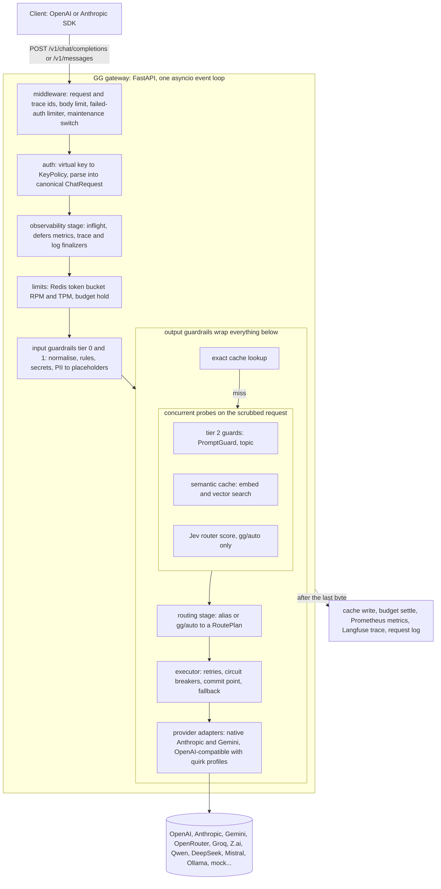

# Architecture

GG is a self-hosted, OpenAI-compatible LLM gateway. Clients point the stock OpenAI (or Anthropic) SDK at GG and get
one API over 25+ providers, plus what a plain proxy does not give them: Jev-based weak/strong routing, input and
output guardrails with reversible PII redaction, exact and semantic caching, per-key limits and budgets, cross-provider
fallback, and per-request cost, latency and traces.

## Request lifecycle

The pipeline is an onion of `Stage`s (`gg.pipeline`). Each stage can annotate the shared `RequestContext`,
short-circuit (cache hit, block) or call the next stage. The output guard stage sits outside the cache and the
executor, so cached replies are guarded and PII-restored like fresh ones.

## Ordering decisions

| Decision | Why |
|---|---|
| Redact PII and secrets before routing and caching | Jev and PromptGuard are third-party APIs; they and the caches only ever see placeholders like `[EMAIL_1]`. The original values live in a per-request vault and are restored in the reply. |
| Router, tier-2 guards and semantic cache run concurrently | All three only read the prompt, so Jev's ~300 ms does not stack on guard latency. Precedence decides: a guard block beats a semantic hit, which beats the routing decision. |
| Router fails open, security guards fail per policy | A Jev timeout or open breaker routes strong; PromptGuard outages fall back to the local rule pack instead of blocking traffic. |
| Commit point | Retries and fallback are only possible before the first content byte reaches the client. After that, an upstream failure becomes an in-stream error event. |
| Work after the last byte | Cache writes, budget settlement, metrics, traces and the request log run as shielded finalizers, so they never add to latency. |

## Components

| Package | Responsibility |
|---|---|
| `gg.core` | canonical OpenAI Chat Completions schema, `RequestContext`, errors, usage and money (micro-USD), clock, vault |
| `gg.pipeline` | stage protocol, onion runner with exclusive per-stage timing, concurrent probes |
| `gg.config` | typed settings (`GG_*` env), YAML loader with cross-validation and a config hash |
| `gg.app` | composition root (`build_app`): wires every component, owns the lifespan |
| `gg.api`, `gg.auth` | OpenAI and Anthropic ingress, SSE writer, error mapping, `x-gg-*` headers, virtual keys, demo safety |
| `gg.providers` | adapter contract, model catalog (canonical models, host deployments, groups, aliases), native and OpenAI-compatible adapters |
| `gg.reliability` | executor: retry policy, per-deployment circuit breakers, fallback chains, commit point |
| `gg.routing` | `RoutingScorer` (Jev; others plug in), threshold policy, `gg/auto`, decision cache, routing eval harness |
| `gg.guardrails` | guard engine, policy YAML with shadow mode, rule packs, PII vault, stream guard, ONNX models, PromptGuard |
| `gg.cache` | exact and semantic cache (Redis 8 vector search), SSE replay, single-flight, fail-open |
| `gg.limits` | Lua token buckets, budget ledger, cost calculator, per-provider spend guard |
| `gg.observability` | Prometheus metrics, request record, timing math, Langfuse traces over OTLP |
| `gg.evalgate` | CI eval gate over the guardrail and cache suites |

Import boundaries are enforced by import-linter: feature packages only see each other's `base` modules, and only
`gg.app` and `gg.cli` see everything.

## Design patterns

- **Adapter**: one `ProviderAdapter` protocol; native adapters for Anthropic and Gemini, one generic
  OpenAI-compatible adapter driven by YAML quirk profiles, so most new providers are config, not code.
- **Strategy and registry**: routing scorers, guards and embedders are registered by name and chosen in YAML.
- **Chain of responsibility**: the pipeline stages and guard chains.
- **Decorator**: the spend guard wraps every adapter; routing decorators add caching and circuit breaking to scorers.
- **Circuit breaker**: per deployment in the executor, and for Jev and PromptGuard.
- **Dependency injection**: `build_app(settings, overrides)` is the only place concrete classes meet; tests inject
  clocks, transports and spend guards through `Overrides`.

## Deployment

`docker compose up` runs the gateway, Redis 8, Prometheus and Grafana; `--profile langfuse` adds a self-hosted
Langfuse v4; `--profile hosted` adds Caddy with TLS for the public demo. See [deploy.md](deploy.md) and [ci.md](ci.md).
